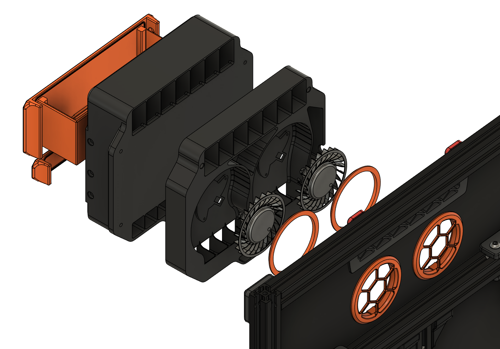

# Proton Pack

## Introduction
The Proton Pack is a recirculating air filter designed for the Voron Trident.
It draws inspiration from the [Pepe Pack](https://github.com/smooshworx/pepe-pack) by smooshworx, but was ultimately sketched and built from scratch.
 
## Features
- Dual 60mm blower fans for pushing bulk air
- HEPA filter for pre-filtering before carbon
- Intake thermistor mount for easy chamber temperature reading
 

## Bill of Materials

Qty | Item
---: | ---
2 | [Delta KFB0612HAFDB](https://www.digikey.com.au/en/products/detail/delta-electronics/KFB0612HAFDB/9974259)
1 | 119x43x9-12mm HEPA filter (for robovacs typically, this is the one I got: <https://www.aliexpress.com/item/1005002244857661.html>)
6 | M2x5mm self-tapping plastic screws
10 | M3 threaded inserts (Voron spec - 3x4x5mm)
1 | M3 roll-in nut
8 | M3x8mm bolt
3 | M3x12mm bolt\*
12 | 6x3mm round neodymium magnets (either N35 or N52 grade)
1 | Cartridge style thermistor, 3mm diameter (optional)
1 | Bag of non-acidic carbon pellets (e.g. Nevermore - see [here](https://github.com/nevermore3d/Nevermore_Micro?tab=readme-ov-file#sourcing-the-proper-acid-free-carbon) for more info on the importance of getting the right carbon)

\**note: these may need to be longer if you have thicker panels/seals, see assembly steps below*
 
## Printed parts/options
**Fan Housing** - print as-is  
**Filter Housing** - select one:
- FilterHousingM6 - for M6 threaded bowden couplings (I recommend drilling these out so that the PTFE can pass through the whole fitting)
- FilterHousingM10 - for M10 threaded bowden couplings, these should already allow the PTFE to pass through completely
- FilterHousingPassthru - for passing the bowden tube through with no threaded coupling
- FilterHousingBlank - no bowden passthru, for use with internal spool holders

**Inserts** - print all:
- BasketCover
- BasketBody
- HepaCover

**Panel Shim** - print the size that matches the gasket thickness for your back panel (i.e. the thickness of the foam/rubber tape between your extrusions and back panel)  
**Fan Grilles** - print TWO of each:
- Grille that matches your panel thickness
- RetainingRing

There is also a printable ~~triforce~~ template for marking out where to drill the necessary panel holes.
This attaches to the two standard exhaust mounting points, the two holes below that indicate the centre of the 54mm intake holes, and the bottom one is for an M3 bolt to pass through.

## Printing notes
Printing the larger housing pieces can be challenging, they don't have to be ultra-strong but they *cannot* be warped or the unit will not seal.
There are also some challenging bridging and tall narrow sections that can be a pain.
I would also recommend running a skew calibration on your printer if you haven't already, since this is most noticeable on large back-to-back pieces like the two halves of the housing.

My final prototypes were printed in eSun ABS+ with 2 perimeters and 18% gyroid infill, and other than one of the vanes between the HEPA and carbon sections snapping (which I've since thickened, and also isn't really an issue) I've had no issues with it.
 
## Assembly
1. Cut out the required holes on your back panel, using the provided cutting template if needed.  
   The fan intake holes need to be 54mm in diameter, and the lower mounting hole needs to allow an M3 bolt to pass through.
2. While the back panel is off, place the M3 roll-in nut on the vertical brace, just below the belts between the A/B motors (the nut hole should sit ~22mm below the top of the extrusion)
3. Clip the printed panel shim in over the nut, then replace the panel and make sure the holes line up
4. Insert 6 threaded inserts into the holes around the edges of the fan housing - 4x on the back side, 2x on the front at the top (be careful with these, as the hole is notably deeper than the insert to account for varying bolt lengths)
5. Insert the remaining 4 threaded inserts into the basket body
6. Install 6 of the magnets along the sides of the filter housing, you can use a dab of super glue if it's not a tight fit
7. Install the remaining magnets in the holes in the HEPA cover and basket cover, again using super glue if necessary (or for peace of mind)
8. Screw the basket cover onto the basket body using 4x M3x8mm bolts
9. Thread the fan wires through the cable holes and screw them down with the M2x5mm screws
10. Insert the thermistor, if using, by passing the wires down the channel on the right then pulling the cartridge into the hole
11. Trim and terminate the fan and thermistor wires with a microfit connector or similar\*
    These should have enough length to sit on the other side of the outer passthrough hold (on the side of the fan housing) for easy disconnection
13. Attach the fan housing to the back panel with 3x M3x12mm bolts (or longer if your back panel and/or sealing strips are thicker than 3-4mm) using the two standard mounting holes at the top (from inside the printer) and the third mounting hole screwing into the roll-in nut at the bottom (from the back of the printer)  
   Ensure that the housing is mounted flush to the panel, and that the shim is holding the panel flat and not causing it to bulge in or out
14. Make sure the fan wires are running along their channels, then attach the filter housing to the fan housing with 4x M3x8mm bolts
15. Insert the HEPA filter/s into the lower cavity (it should just slide in), then cover with the printed HEPA cover
16. Pour some carbon pellets into the basket (I fill mine up about 3/4), then slide it into the upper cavity
17. Screw in your bowden coupling if using, and pass through your bowden tube

\**A note on fan wires: technically you only need the red and black wires from each fan, and cut off the yellow and blue. However, I've found with these particular fans that they don't seem to like being controlled by voltage - anything below 100% and they slow down quite a lot, and below 90% they stall.*
*It may be worth keeping the PWM wire (blue) and using PWM control, but I haven't looked into it myself*
